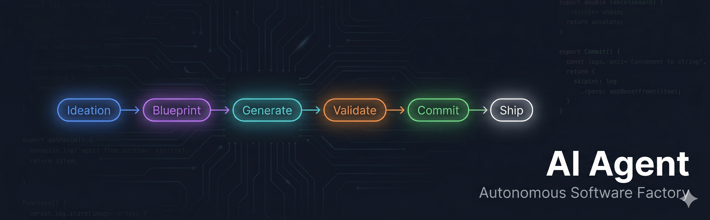
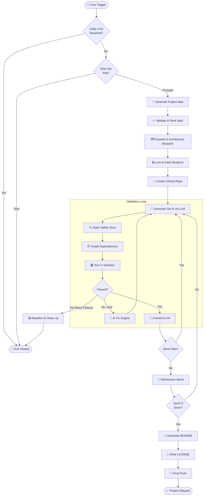
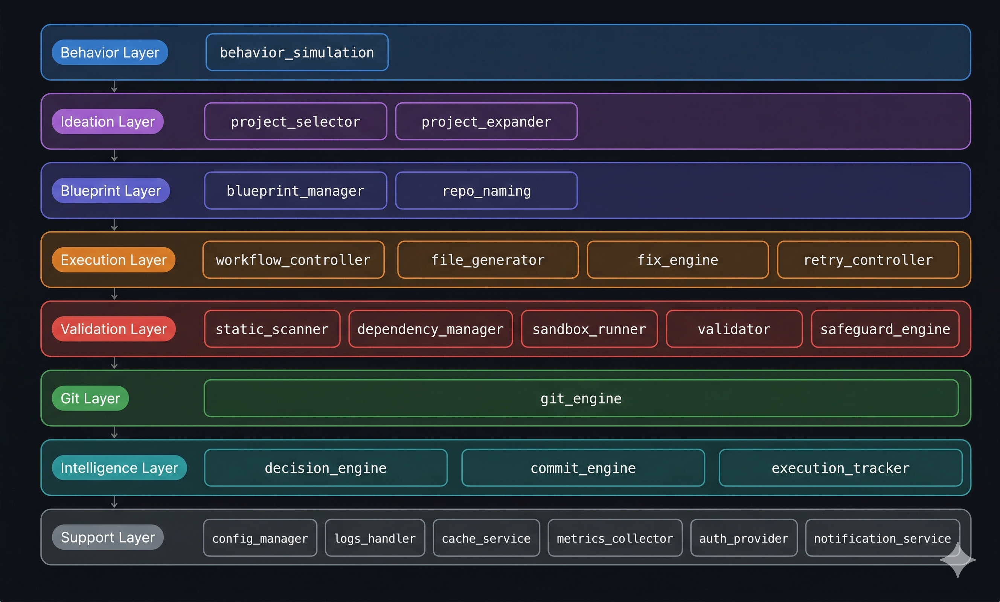

<div align="center">



<br/>

# AI Agent — Autonomous Software Factory

### *An AI system that ideates, builds, validates, and ships Python projects to GitHub — fully unattended.*

<br/>

[](https://python.org)
[](https://deepmind.google/technologies/gemini/)
[](https://docs.github.com/en/rest)
[](LICENSE)
[]()

<br/>

| 24+ Projects Shipped | 30+ Modules | 3-Sprint Refinement | Zero Human Intervention |
|:---:|:---:|:---:|:---:|
| Autonomous output | Production architecture | Self-expanding codebase | End-to-end automation |

</div>

---

## What This Is

This is a **closed-loop autonomous development agent** — a system that behaves like a software engineer running on a cron job. Given no input, it:

1. Decides what to build
2. Designs the architecture
3. Writes every file, one at a time, using an LLM
4. Tests each file in an isolated sandbox before committing
5. Repairs failures automatically
6. Pushes a complete, documented project to GitHub

It has shipped **24+ real Python repositories** to GitHub — each with its own README, LICENSE, and commit history — with no manual intervention.

---

## Pipeline



---

## Architecture

<div align="center">

</div>

<br/>

```
main.py                      ← Cron-triggered pipeline entry point
│
├── Behavior Layer
│   └── behavior_simulation.py   ← Pacing, skip-day logic, work windows
│
├── Ideation Layer
│   ├── project_selector.py      ← LLM idea generation with category rotation
│   └── project_expander.py      ← Idea → full file architecture blueprint
│
├── Blueprint Layer
│   ├── blueprint_manager.py     ← Locking, hashing, interface contracts
│   └── repo_naming.py           ← Sanitized kebab-case repo name generation
│
├── Execution Layer
│   ├── workflow_controller.py   ← File-by-file orchestration loop
│   ├── file_generator.py        ← LLM code generation, one file at a time
│   ├── fix_engine.py            ← LLM-powered repair on failure
│   └── retry_controller.py      ← Rate limit & API failure classification
│
├── Validation Layer
│   ├── static_scanner.py        ← Pre-execution safety scan
│   ├── dependency_manager.py    ← Import extraction + pip install
│   ├── sandbox_runner.py        ← Isolated subprocess execution
│   ├── validator.py             ← Output structure & field validation
│   └── safeguard_engine.py      ← Final gate: all checks must pass
│
├── Git Layer
│   └── git_engine.py            ← Git CLI wrapper + GitHub API integration
│
├── Intelligence Layer
│   ├── decision_engine.py       ← Abandonment logic & project completion
│   ├── commit_engine.py         ← Semantic commit message generation
│   └── execution_tracker.py     ← Per-file attempt & error tracking
│
└── Support Layer
    ├── state_manager.py         ← Persistent project state (JSON)
    ├── cost_monitor.py          ← Token usage & budget enforcement
    ├── dynamic_monitor.py       ← Runtime anomaly detection
    ├── storage_manager.py       ← Local backup & workspace cleanup
    ├── project_history.py       ← Cross-run deduplication
    ├── config_loader.py         ← Env config + API key rotation
    └── logger.py                ← Structured logging (console + file)
```

---

## Engineering Highlights

<table>
<tr>
<td width="50%">

**Blueprint-as-Contract**

Every project starts with a locked, SHA-256 hashed blueprint. All generated code is validated against it — if the blueprint changes mid-run, the system detects drift and halts.

</td>
<td width="50%">

**Sandbox-First Commits**

No file touches the git index until it has successfully executed in an isolated subprocess. Bad code cannot reach the repository by design.

</td>
</tr>
<tr>
<td width="50%">

**Self-Healing Loop**

On failure, the same error log is fed back to the LLM with a structured repair prompt. The system retries up to 3 times before escalating to a skip or project abandonment.

</td>
<td width="50%">

**Graceful Abandonment**

Projects with ≥3 failures at <50% completion are silently abandoned — remote repo deleted via API, local workspace cleaned, history updated. No orphaned state.

</td>
</tr>
<tr>
<td width="50%">

**API Key Rotation**

Multiple Gemini API keys are discovered from environment variables and cycled automatically on quota exhaustion. Combined with a per-model fallback chain, the system tries up to N×4 combinations before giving up.

</td>
<td width="50%">

**Refinement Sprints**

After the initial build, the agent runs up to 2 additional LLM-guided sprints — each generating new module files to expand the project beyond its original blueprint.

</td>
</tr>
</table>

---

## Tech Stack

<div align="center">

| Layer | Technology |
|---|---|
| Language | Python 3.10+ |
| LLM | Google Gemini (2.5 Flash / Pro / 1.5 Pro) |
| Version Control | Git CLI + GitHub REST API |
| Sandboxing | `subprocess` isolated execution |
| Config | `.env` via `python-dotenv` |
| Serialization | JSON + YAML |
| Monitoring | `psutil` process metrics |

</div>

---

## Configuration

All behavior is controlled via a `.env` file — no code changes required to tune the agent.

| Variable | Description | Default |
|---|---|---|
| `GEMINI_API_KEY` | Primary Gemini API key | required |
| `GEMINI_API_KEY_2` ... | Additional keys for rotation | optional |
| `GITHUB_TOKEN` | GitHub personal access token | required |
| `GITHUB_USERNAME` | GitHub account username | required |
| `GITHUB_EMAIL` | Git committer email | required |
| `SKIP_DAY_CHANCE` | Probability of skipping a day (0.0–1.0) | `0.01` |
| `MIN_START_DELAY` | Minimum startup delay in seconds | `0` |
| `MAX_START_DELAY` | Maximum startup delay in seconds | `300` |
| `DAILY_TOKEN_LIMIT` | Max LLM tokens consumed per day | `1000000` |
| `DAILY_CALL_LIMIT` | Max LLM API calls per day | `500` |
| `ELITE_MODE` | Enables advanced project generation | `false` |

---

## License

This project is published under a **Source Available — Non-Commercial** license.
See [LICENSE](LICENSE) for full terms.

**TL;DR:** You may read, study, and fork this for personal/educational use.
Commercial use requires a written agreement with the author.

---

<div align="center">

**Built by [Manas Gawde](https://github.com/Manas236)**

*If this project interests you — for collaboration, hiring, or commercial licensing — reach out via GitHub.*

</div>
